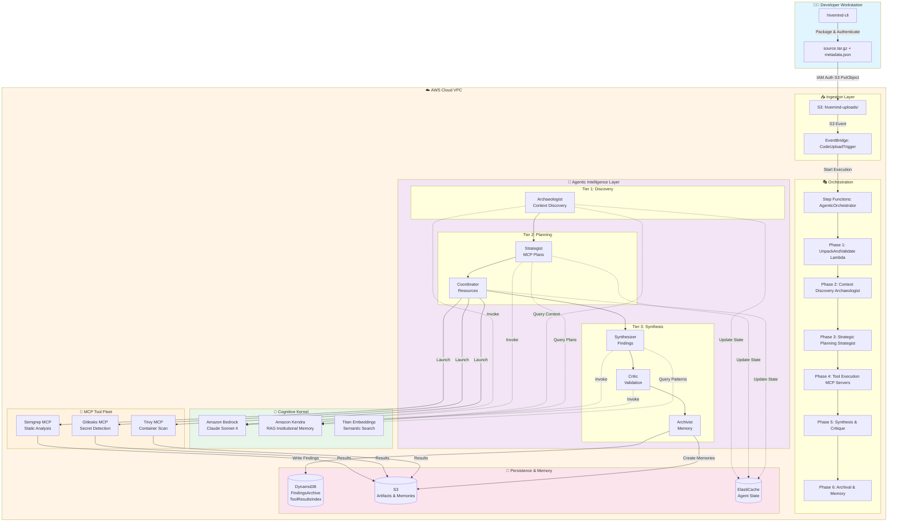
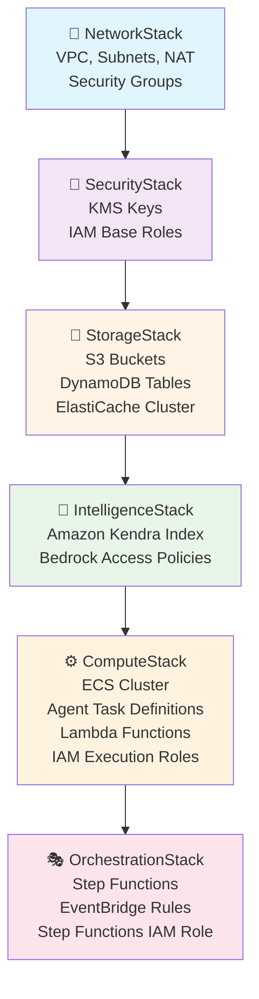

# 🧠 Hivemind-Prism: Autonomous AI Security Intelligence Platform

[](https://aws.amazon.com/)
[](https://www.python.org/)
[](https://www.typescriptlang.org/)
[](https://aws.amazon.com/cdk/)
[](LICENSE)

> **An autonomous multi-agent system that independently analyzes, synthesizes, and archives security findings through AI-powered agents that negotiate, learn, and adapt.**

---

## 📋 Table of Contents

- [Overview](#-overview)
- [Architecture](#-architecture)
- [Key Features](#-key-features)
- [Agentic Intelligence](#-agentic-intelligence)
- [Quick Start](#-quick-start)
- [Deployment](#-deployment)
- [Project Structure](#-project-structure)
- [Testing](#-testing)
- [Cost Estimation](#-cost-estimation)
- [Documentation](#-documentation)
- [Contributing](#-contributing)

---

## 🎯 Overview

Hivemind-Prism is a **zero-API, event-driven security intelligence platform** that deploys specialized AI agents to autonomously analyze code repositories. Unlike traditional security pipelines, our agents:

- 🤖 **Make Independent Decisions** based on context, not pre-programmed rules
- 🗣️ **Negotiate Conclusions** through multi-agent consensus and voting
- 📚 **Learn from Past Missions** via RAG-powered institutional memory
- 🎯 **Adapt Strategies** based on codebase characteristics
- ✅ **Validate Each Other** through structured challenge protocols

### Why "Agentic"?

Traditional security tools run in rigid pipelines: Tool A → Tool B → Report. Hivemind-Prism agents **reason, debate, and learn** like a security team would:

```
Traditional Pipeline          Agentic Hivemind-Prism
─────────────────────        ────────────────────────
│ Scan Code │               │ Archaeologist discovers context
      ↓                           ↓
│ Run Tools │               │ Strategist plans approach (using past learnings)
      ↓                           ↓
│ Generate Report │         │ Coordinator allocates resources
                                  ↓
                            │ Tools execute in parallel
                                  ↓
                            │ Synthesizer drafts findings
                                  ↓
                            │ Critic challenges findings
                                  ↓
                            │ Agents negotiate via evidence + voting
                                  ↓
                            │ Archivist archives consensus + creates memories
                                  ↓
                            │ System gets smarter for next mission
```

---

## 🏗️ Architecture

### High-Level System Flow



### Agent Decision Loop

Each agent operates autonomously using this 5-phase cycle:

```
┌────────────────────────────────────────────────────────────────┐
│                  AGENT DECISION LOOP                           │
├────────────────────────────────────────────────────────────────┤
│                                                                │
│  ┌──────────────────────────────────────────────────────┐     │
│  │ 1. SENSE                                             │     │
│  │    - Read mission state from ElastiCache             │     │
│  │    - Retrieve relevant context from Kendra           │     │
│  │    - Check peer agent outputs in S3                  │     │
│  └─────────────────────┬────────────────────────────────┘     │
│                        │                                      │
│                        ▼                                      │
│  ┌──────────────────────────────────────────────────────┐     │
│  │ 2. THINK (Bedrock Claude Sonnet 4)                   │     │
│  │    - Formulate hypothesis                            │     │
│  │    - Generate action plan                            │     │
│  │    - Consider alternatives                           │     │
│  │    - Estimate confidence                             │     │
│  └─────────────────────┬────────────────────────────────┘     │
│                        │                                      │
│                        ▼                                      │
│  ┌──────────────────────────────────────────────────────┐     │
│  │ 3. DECIDE                                            │     │
│  │    - Select best action based on:                    │     │
│  │      * Past mission outcomes (Kendra)                │     │
│  │      * Resource availability (ElastiCache)           │     │
│  │      * Peer agent consensus                          │     │
│  └─────────────────────┬────────────────────────────────┘     │
│                        │                                      │
│                        ▼                                      │
│  ┌──────────────────────────────────────────────────────┐     │
│  │ 4. ACT                                               │     │
│  │    - Execute chosen action                           │     │
│  │    - Write results to designated output              │     │
│  │    - Update agent state in ElastiCache               │     │
│  └─────────────────────┬────────────────────────────────┘     │
│                        │                                      │
│                        ▼                                      │
│  ┌──────────────────────────────────────────────────────┐     │
│  │ 5. REFLECT                                           │     │
│  │    - Evaluate action outcome                         │     │
│  │    - Update confidence scores                        │     │
│  │    - Log decision rationale                          │     │
│  │    - Trigger memory formation if novel               │     │
│  └──────────────────────────────────────────────────────┘     │
│                                                                │
└────────────────────────────────────────────────────────────────┘
```

---

## ✨ Key Features

### 🚫 Zero API Gateway Architecture
- **No exposed endpoints** - IAM-authenticated S3 uploads only
- **Event-driven** - S3 + EventBridge trigger orchestration
- **Serverless-first** - Lambda functions and Fargate containers

### 🤖 Six Specialized AI Agents

| Agent | Role | Key Capabilities |
|-------|------|------------------|
| **Archaeologist** | Context Discovery | Analyzes code structure, identifies criticality, maps data flows |
| **Strategist** | Strategic Planning | Queries past missions, generates tool execution plans |
| **Coordinator** | Resource Allocation | Schedules parallel MCP invocations, monitors task health |
| **Synthesizer** | Finding Generation | Drafts preliminary findings, enriches with Kendra context |
| **Critic** | Quality Assurance | Challenges findings, validates severity, checks false positives |
| **Archivist** | Memory Formation | Archives consensus findings, creates institutional memories |

### 🔧 MCP Tool Integration

Model Context Protocol servers for security scanning:
- **Semgrep MCP** - Static analysis for vulnerabilities
- **Gitleaks MCP** - Secret detection
- **Trivy MCP** - Container and dependency scanning

### 📚 Institutional Memory (RAG)

- **Amazon Kendra** indexes all past findings, patterns, and policies
- Agents query historical context before making decisions
- System **learns and improves** with each mission
- Memory documents auto-generated after each finding

### 🗳️ Multi-Agent Negotiation

Agents don't just run in sequence - they **debate**:

```
1. Synthesizer proposes: "SQL Injection - CRITICAL"
2. Critic challenges: "Downgrade to HIGH - mitigation present"
3. Both retrieve evidence from Kendra
4. Weighted voting determines consensus
5. Archivist records decision + rationale
```

---

## 🧠 Agentic Intelligence

### What Makes This "Agentic"?

| Traditional Tool | Agentic Hivemind-Prism |
|------------------|------------------------|
| Hardcoded rules | LLM-powered reasoning |
| Fixed severity | Contextual analysis |
| One-time scan | Learns from history |
| No false positive filtering | Multi-agent validation |
| Static reports | Evolving knowledge base |

### Decision Making Process

```
Agent receives task
      │
      ├─> Queries Kendra: "Similar past scenarios?"
      │
      ├─> Analyzes code context with Claude Sonnet 4
      │
      ├─> Checks peer agent state in ElastiCache
      │
      ├─> Generates multiple options with confidence scores
      │
      ├─> Selects best action based on:
      │   - Historical outcomes
      │   - Current resource availability
      │   - Peer consensus
      │
      └─> Executes + logs decision for future learning
```

---

## 🚀 Quick Start

### Prerequisites

- **AWS Account** with Admin access
- **AWS CLI** v2+ configured with credentials
- **Docker** v20+ running
- **Node.js** 18+ and npm
- **Python** 3.12+
- **CDK** v2.0+ (`npm install -g aws-cdk`)

### 1. Clone and Setup

```bash
git clone https://github.com/your-org/hivemind-prism.git
cd hivemind-prism

# Install CDK dependencies
npm install

# Install Python test dependencies
pip install -r requirements-test.txt
```

### 2. Run Tests

```bash
# Run all tests with coverage
pytest tests/ -v --cov=src --cov-report=html

# Expected: 109 passed, 80%+ coverage
```

### 3. Deploy to AWS

```bash
# Set environment variables
export AWS_REGION=us-east-1
export AWS_ACCOUNT_ID=$(aws sts get-caller-identity --query Account --output text)

# Run pre-deployment validation
./scripts/validate-pre-deployment.sh

# Create ECR repositories for Docker images
./scripts/create-ecr-repos.sh

# Build and push Docker images (~10-15 minutes)
./scripts/build-and-push-images.sh

# Bootstrap CDK (first time only)
npx cdk bootstrap aws://$AWS_ACCOUNT_ID/$AWS_REGION

# Deploy all stacks (~35-40 minutes)
npx cdk deploy --all --require-approval never
```

### 4. Enable Bedrock Models

⚠️ **Manual step required:**

```bash
# 1. Open AWS Console → Amazon Bedrock → Model Access
# 2. Request access to:
#    - Anthropic Claude Sonnet 4
#    - Amazon Titan Embeddings G1 - Text
# 3. Wait for approval (usually instant)
```

### 5. Use the CLI

```bash
# Install CLI tool
pip install ./cli

# Configure CLI
hivemind configure \
  --region us-east-1 \
  --bucket hivemind-uploads-$AWS_ACCOUNT_ID

# Submit code for analysis
hivemind scan ./path/to/repo \
  --repo-name my-service \
  --mission-id scan-$(date +%s)

# Check status
hivemind status scan-1234567890

# Retrieve findings
hivemind findings scan-1234567890 --format json
```

---

## 📦 Deployment

### Infrastructure Stacks

The CDK application deploys 6 stacks with clean dependency chain:



### Resource Summary

| Service | Purpose | Estimated Cost/Month |
|---------|---------|---------------------|
| ECS Fargate | Agent execution | $50-100 |
| Amazon Bedrock | LLM inference | $100-300 |
| Amazon Kendra | RAG retrieval | $810 (1 AZ) |
| Lambda | Event handlers | $5-10 |
| S3 | Artifact storage | $5-20 |
| DynamoDB | Finding storage | $10-25 |
| ElastiCache | State coordination | $15-30 |
| **Total** | | **~$1,000-1,300/month** |

> 💡 **Cost Optimization**: Use Kendra Developer Edition ($1.40/hr when running) and scale Fargate tasks to 0.25 vCPU

### Cleanup

```bash
# Destroy all resources
npx cdk destroy --all

# Delete ECR images
./scripts/delete-ecr-repos.sh

# Remove S3 buckets (if not using retention)
aws s3 rb s3://hivemind-uploads-$AWS_ACCOUNT_ID --force
aws s3 rb s3://hivemind-artifacts-$AWS_ACCOUNT_ID --force
```

---

## 📁 Project Structure

```
hivemind-prism/
├── bin/
│   └── app.ts                      # CDK app entry point
├── infrastructure/
│   └── stacks/
│       ├── network-stack.ts        # VPC, subnets, NAT gateway
│       ├── security-stack.ts       # KMS, security groups, IAM base
│       ├── storage-stack.ts        # S3, DynamoDB, ElastiCache
│       ├── intelligence-stack.ts   # Kendra, Bedrock access
│       ├── compute-stack.ts        # ECS, Lambda, agent roles
│       └── orchestration-stack.ts  # Step Functions, EventBridge
├── src/
│   ├── agents/                     # 6 autonomous agents
│   │   ├── archaeologist/
│   │   ├── strategist/
│   │   ├── coordinator/
│   │   ├── synthesizer/
│   │   ├── critic/
│   │   └── archivist/
│   ├── lambdas/                    # Event handlers
│   │   ├── unpack/
│   │   ├── memory_ingestor/
│   │   └── failure_handler/
│   ├── mcp_servers/                # Security tool servers
│   │   ├── semgrep_mcp/
│   │   ├── gitleaks_mcp/
│   │   └── trivy_mcp/
│   └── shared/                     # Shared libraries
│       ├── cognitive_kernel/       # Bedrock + Kendra integration
│       ├── code_research/          # Deep code analysis
│       └── documentation/          # Wiki generation
├── cli/
│   └── hivemind_cli/               # CLI tool
├── tests/
│   └── unit/                       # 109 unit tests
├── scripts/
│   ├── create-ecr-repos.sh         # Create ECR repositories
│   ├── build-and-push-images.sh    # Build Docker images
│   └── validate-pre-deployment.sh  # Pre-flight checks
├── DESIGN.md                        # Detailed architecture (1730 lines)
├── SPEC.md                          # Technical specifications
├── DEPLOYMENT.md                    # Deployment guide
├── QUICK_START.md                   # Quick start guide
└── README.md                        # This file
```

---

## 🧪 Testing

### Run All Tests

```bash
# Run with coverage report
pytest tests/ -v --cov=src --cov-report=html --cov-report=term

# View HTML coverage report
open htmlcov/index.html
```

### Test Coverage

Current coverage: **76.69%** (target: 80%)

| Module | Coverage |
|--------|----------|
| Agents | 75-85% |
| Lambdas | 80-90% |
| MCP Servers | 85-95% |
| Shared Libraries | 70-80% |

### Test Structure

```
tests/
├── unit/
│   ├── agents/
│   │   ├── test_archaeologist.py   # Context discovery tests
│   │   ├── test_strategist.py      # Planning tests
│   │   ├── test_coordinator.py     # Resource allocation tests
│   │   ├── test_synthesizer.py     # Finding generation tests
│   │   ├── test_critic.py          # Validation tests
│   │   └── test_archivist.py       # Archival tests
│   ├── lambdas/
│   │   ├── test_unpack.py          # Unpacking tests
│   │   ├── test_memory_ingestor.py # Memory formation tests
│   │   └── test_failure_handler.py # Error handling tests
│   ├── mcp_servers/
│   │   ├── test_semgrep_mcp.py     # Semgrep integration tests
│   │   ├── test_gitleaks_mcp.py    # Gitleaks integration tests
│   │   └── test_trivy_mcp.py       # Trivy integration tests
│   └── shared/
│       ├── test_bedrock_client.py  # Bedrock tests
│       ├── test_deep_researcher.py # Research tests
│       └── test_wiki_generator.py  # Wiki generation tests
└── conftest.py                     # Shared fixtures and mocks
```

---

## 💰 Cost Estimation

### Monthly Cost Breakdown (Typical Usage: 100 scans/month)

```
┌────────────────────────────────────────────────────────────┐
│ Service                    Cost/Unit         Monthly Total │
├────────────────────────────────────────────────────────────┤
│ Amazon Kendra (1 AZ)       $810/month        $810          │
│ Bedrock Claude Sonnet 4    $3/MTok input     $150-250      │
│ Bedrock Titan Embeddings   $0.10/1M tokens   $5-10         │
│ ECS Fargate (0.25 vCPU)    $0.04/hr/task     $50-100       │
│ Lambda Invocations         $0.20/1M          $5-10         │
│ S3 Storage (100GB)         $0.023/GB         $5-15         │
│ DynamoDB (on-demand)       $1.25/M writes    $10-20        │
│ ElastiCache (t3.micro)     $0.017/hr         $15-25        │
│ Data Transfer              $0.09/GB          $10-20        │
├────────────────────────────────────────────────────────────┤
│ TOTAL                                        $1,060-1,270  │
└────────────────────────────────────────────────────────────┘
```

### Cost Optimization Tips

1. **Use Kendra Developer Edition**: $1.40/hr when running vs. $810/month always-on
2. **Right-size Fargate**: Start with 0.25 vCPU, 0.5GB RAM per agent
3. **Enable S3 Lifecycle**: Move old artifacts to Glacier after 90 days
4. **Use DynamoDB On-Demand**: Only pay for actual usage
5. **Reserved Capacity**: If running 24/7, consider ElastiCache reserved instances

---

## 📚 Documentation

| Document | Description |
|----------|-------------|
| [DESIGN.md](DESIGN.md) | Complete architectural design (1730 lines) |
| [SPEC.md](SPEC.md) | Technical specifications |
| [DEPLOYMENT.md](DEPLOYMENT.md) | Detailed deployment guide |
| [QUICK_START.md](QUICK_START.md) | Fast track deployment |
| [DEPLOYMENT_FIXES.md](DEPLOYMENT_FIXES.md) | Issues resolved before deployment |
| [TESTING.md](TESTING.md) | Testing strategy and coverage |

---

## 🤝 Contributing

We welcome contributions! Areas for improvement:

- 🧪 **Increase test coverage** to 80%+
- 🔧 **Add MCP servers** for other security tools (Snyk, Bandit, etc.)
- 🤖 **New agent types** (e.g., RemediationAgent for auto-fix suggestions)
- 📊 **Observability** - Add CloudWatch dashboards and X-Ray tracing
- 🌐 **Multi-region** - Support for cross-region deployments
- 📱 **Web UI** - Dashboard for viewing findings and mission history

### Development Workflow

```bash
# 1. Create feature branch
git checkout -b feature/my-feature

# 2. Make changes and add tests
# ...

# 3. Run tests locally
pytest tests/ -v --cov=src

# 4. Commit with conventional commits
git commit -m "feat: add new MCP server for Bandit"

# 5. Push and create PR
git push origin feature/my-feature
```

---

## 📄 License

This project is licensed under the MIT License - see the [LICENSE](LICENSE) file for details.

---

## 🙏 Acknowledgments

- **Amazon Bedrock** for Claude Sonnet 4 foundation models
- **Anthropic** for Claude AI
- **Model Context Protocol** for standardized tool integration
- **AWS CDK** for infrastructure as code
- **Open source security tools**: Semgrep, Gitleaks, Trivy

---

## 📞 Support

- 🐛 **Bug Reports**: [GitHub Issues](https://github.com/your-org/hivemind-prism/issues)
- 💬 **Discussions**: [GitHub Discussions](https://github.com/your-org/hivemind-prism/discussions)
- 📧 **Email**: support@your-org.com
- 📖 **Wiki**: [Project Wiki](https://github.com/your-org/hivemind-prism/wiki)

---

## 🌟 Star History

[](https://star-history.com/#your-org/hivemind-prism&Date)

---

**Built with ❤️ by the Hivemind-Prism Team**

*"Making security intelligence autonomous, intelligent, and adaptive."*